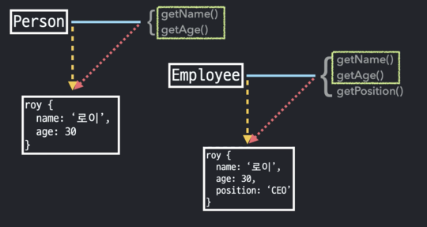
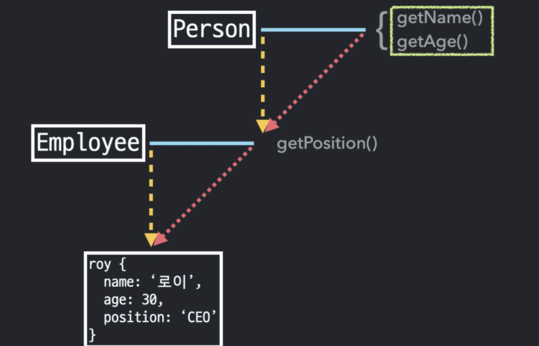
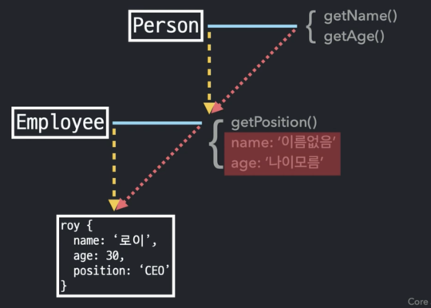
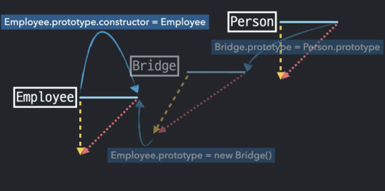

### **class**

- 계급집단

- 음식, 과일, [배,사과,바나나,오렌지,감] 이렇게 3집단이 있다고 가정해보자.

> 이때 음식은 추상적인 개념이다. 과일 역시도 추상적인 개념
>
> 반대로 사과, 오렌지 등은 만질수 있고 눈으로 볼 수 있고 먹을 수 도 있다.
>
> 이때 사과,오렌지 등을 가리켜 인스턴스라고 하고 이 인스턴스들의
>
> 공통 속성을 모은 추상적 개념이 `클래스`

- `음식` : superClass (과일의 상위 클래스)
- `과일` : subClass(음식의 하위 클래스)

```js
Array => 클래스

[(1, 2, 3)]; => 인스턴스
```

- `Array prototype` 에 할당되지 않고 Array 생성자함수 객체에 직접 할당되어 있는 프로퍼티들을 `static methods`,`static properties`라고 한다.

- 이들은 `Array` 생성자 함수를 `new` 연산자없이 함수로써 호출할 때만 의미가 있는 값

- `static methods` : `from()`, `isArray()`, `of()`, ...

- `static properties`: `arguments`, `length`, `name`, ...

### **class 와 instance**

> 이때, instance로 부터 `생성자`의 `프로토타입 메서드`로 바로 접근이 가능한 반면 생성자 함수 내부에
>
> 있는 `스태틱 프로퍼티`나 `스태틱 메서드`는 직접적으로 접근할 수 가 없다. 물론 `프로토타입`의
>
> `constructor`를 통해서 `우회` 는가능하나 `인스턴스를 this`로 하기위해서는 별도의 처리가 필요하다.

```js
function Person(name, age) {
  this._name = name;
  this._age = age;
}

Person.getInformations = function (instance) {
  return {
    name: instance._name,
    age: instance._age,
  };
}; //정적 메서드

Person.prototype.getName = function () {
  return this._name;
}; //프로토타입 메서드

Person.prototype.getAge = function () {
  return this._age;
}; //프로토타입 메서드

console.log(instancePerson.getInformations(instancePerson));
// Error
console.log(instancePerson.getName());
// 지홍
console.log(instancePerson.getAge());
// 30
console.log(Person.getInformations(instancePerson));
// {name: "지홍", age: 30}
```

```js
function Person(name, age) {
  this.name = name || '이름 없음';
  this.age = age || '나이 모름';
}

Person.prototype.getName = function () {
  return this._name;
};

Person.prototype.getAge = function () {
  return this._age;
};

function Employee(name, age, position) {
  this.name = name || '이름 없음';
  this.age = age || '나이 모름';
  this.position = position || '직책 모름';
}

Employee.prototype.getAge = function () {
  return this._age;
};

Employee.prototype.getName = function () {
  return this._name;
};

Employee.prototype.getPosition = function () {
  return this._position;
};
```

- 아래의 이미지에서 겹치는 부분이 있다.

  

- 이렇게 프로토 타입 체인닝으로 공통된 부분까지 접근시키면 안될까?

  

```js
Employee.prototype = new Person();
```

- Employee의 프로토 타입에 Person의 인스턴스를 할당
- 하지만 이 결과는 Employee.prototype이 완전히 새로운 객체로 대신해버리게 됨.

```js
Employee.prototype.constructor = Employee;
```

- 더 깔끔하게 만들어보자

```js
function Person(name, age) {
  this.name = name || '이름 없음';
  this.age = age || '나이 모름';
}

Person.prototype.getName = function () {
  return this.name;
};

Person.prototype.getAge = function () {
  return this.age;
};

function Employee(name, age, position) {
  this.name = name || '이름 없음';
  this.age = age || '나이 모름';
  this.position = position || '직책 모름';
}

Employee.prototype = new Person();
Employee.prototype.counstructor = Employee;

Employee.prototype.getPosition = function () {
  return this.position;
};

const jihong = new Employee('지홍', 30, 'CEO');

// jihong => Employee의 인스턴스

// jihong.__proto__ => (Employ Prototype & Person's instance)

// jihong.__proto__.__proto__ => (Person.prototype & Object's instance)
```

- 하지만 `jihong.__proto__` 부분이 문제

- 만약에 jihong객체의 name프로퍼티를 지워버린상태에서 getName메서드를 호출하면 프로토 타입 체이닝을 타고 이름없음을 반환하게 될것이다.

- 프로토타입 체이닝 상에 메서드들만 존재하게 하는 방법은 무엇일까? 브릿지를 놔주자!

  
  

```js
function Bridge() {} //매개체 역할을 하고 코드상에 영향을 주지 않음.
Bridge.prototype = Person.prototype;
Employee.prototype = new Bridge();
Employee.prototype.counstructor = Employee;
Employee.prototype.getPosition = function () {
  return this.position;
};
```

- 이 브릿지를 함수화 시키는 방법 (상속 구조를 연결시켜주는 함수) 어떤 클래스 등 상속구현 이 가능

```js
function Employee(name, age, position) {
  this.superClass(name, age);
}

var extendClass = (function () {
  function Bridge() {} //클로저와 연관지어서 생각하기
  return function (Super, Sub) {
    Bridge.prototype = Super.protoype;
    Sub.prototype = new Bridge();
    Sub.prototype.constructor = Sub;
    Sub.prototype.superClass = Super;
  };
})();

extendClass(Person, Employee);

Employee.prototype.getPosition = function () {
  return this.position;
};
```

- ES6 문법으로 바꿨을때

```js
class Person {
  constructor(name, age) {
    this.name = name || '이름없음';
    this.age = age || '나이모름';
  }
  getName() {
    return this.name;
  }
  getAge() {
    return this.age;
  }
}

class Employee extends Person {
  constructor(name, age, position) {
    super(name, age);
    this.position = position || '직책모름';
  }
  getPosition() {
    return this.position;
  }
}
```
