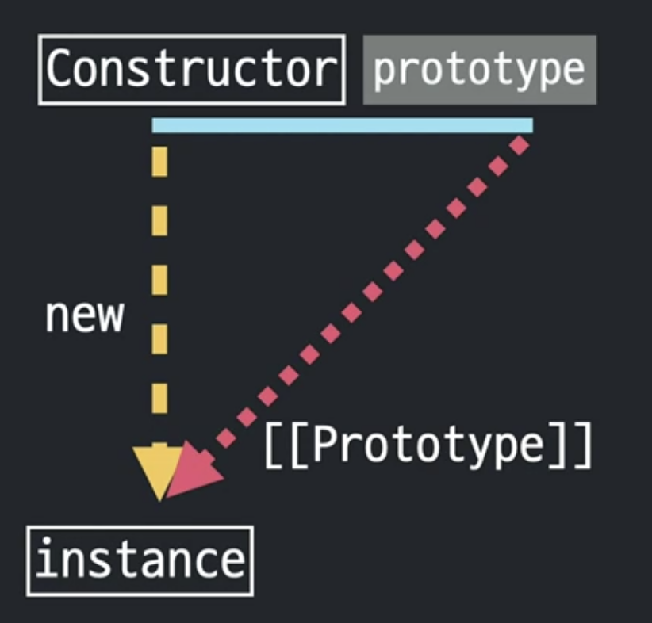

### **Prototype**

- 자바스크립트는 프로토타입 기반의 언어
- 생성자 함수로 생성한 객체들이 프로퍼티와 메소드를 공유하기 위해 사용하는 객체이다.
- 함수만 가지고 있는 프로퍼티이고, 자바스크립트는 모든 것이 객체이므로 함수도 프로퍼티를 가질 수 있다.
- 프로토타입 멤버에서의 this 는 현재 인스턴스를 나타낸다.

Counstructor 라는 생성자 함수에 new 연산자로 instance를 만들면 constructor의 `prototype` 이라고 하는 프로퍼티의 내용이 `[[Prototype]]`라고 하는 프로퍼티로 참조를 전달.

#### **인스턴스**

- 생성자 함수(Constructor)를 통해 생성된 객체를 인스턴스라 부를 수 있다.
- 비슷한 성질을 가진 여러개의 객체를 만들기 위해 사용

> 생성자 함수(Constructor) = 거푸집
>
> 인스턴스 = 거푸집으로 찍어낸 칼

`Constructor.prototype`과 `instance[[Prototype]]`이 같은 객체를 바라보게 됨.

```js
Array
[1,2,3]

Array의 `prototype`의 프로퍼티와 배열 리터럴의 `[[protoType]]`로 연결
```



이는 곧 아래 코드와 같다.

```js
[1,2,3].constructor = [1,2,3].[[Prototype]].constructor = Array.prototype.constructor = Array
```

```js
10.toFixed(2) 의 경우는 어떨까

자바스크립트가 임시로 숫자 리터럴에 해당하는 Number 생성자 함수의 인스턴스를 만들어 그 프로토타입에 있는 메서드를 적용해서 원하는 결과를 얻게 한다음에 다시 인스턴스를 제거하는 식으로 동작

기본형 타입의 데이터들은 이같은 방식에 의해 메서드를 호출
```

참조형 데이터들은 처음부터 인스턴스이기 때문에 메서드를 호출한 순간에 임시로 인스턴스를 생성했다가 폐기하는 복잡한 과정을 거치지는 않는다.

- `null` 과 `undefined`를 제외한 모든 데이터 타입은 생성자 함수가 존재
- 각 생성자 함수의 프로토타입에는 각 데이터 타입에만 해당하는 전용 메서드가 존재

### **instance로 부터 생성자함수의 prototype 프로퍼티에 직접 접근할 수 있는 방법은?**

- `instance.__proto__`
- `Object.getPrototypeOf(instance)` => 공식적인 방법

```js
function Person(n, a) {
  this.name = n;
  this.age = a;
}

var j = new Person('지홍', 30);
var jClone1 = new j.__proto__.constructor('지홍_클론1', 10);
var jClone2 = new j.constructor('지홍_클론2', 15);
var jClone3 = new (Object.getPrototypeOf(j).constructor)('지홍_클론3', 20);
var jClone4 = new Person.prototype.constructor('지홍_클론4', 25);
```

- `Contructor`
- `instance.__proto__.contructor`
- `instance.contructor`
- `Object.getPrototypeOf(instance).contructor`
- `Constructor.prototype.contructor`

```js
var roy = new Person('로이', 30);
var jay = new Person('제이', 25);

roy.setOlder = function(){
  this.age +=1
}

roy.getAge = function(){
  return this.age
}

jay.setOlder = function(){
  this.age +=1
}

jay.getAge = function(){
  return this.age
}

=> DRY

Person.prototype.setOlder = function () {
  this.age += 1;
};

Person.prototype.getAge = function () {
  return this.age;
};

인스턴스들은 고유한 정보만 가지고 있으면 되고 인스턴스들이 모두 똑같이 가지는 정보들은 prototype으로 보내기 메모리 사용 최적화!
```

### **Prototype Chaining**

- 객체 생성자 함수에 직접 메서드를 정의 할 수 밖에 없음
- 객체 관련한 명령어들은 객체로부터 직접 메서드를 호출하는 대신에 Object.명령어를 호출하면서 그 매개변수로 객체 자신을 넘겨주는 방식을 취하는 이유는 프로토타입 체인 때문임


```js
[1, 2, 3].toString();
//'1,2,3'

delete Array.prototype.toString[
  //true

[1, 2, 3].toString();
//'[object Array]' 프로토 타입으로 확인가능

delete Object.prototype.toString[

[1, 2, 3].toString();
//toString is not a function
```

- 원래의 경우


- 모든 프로토타입 체이닝의 종점은 Object.prototype이다.
